# Apache-Kafka-
Explore Kafka and basic distributed system concepts.

## First exercise. Topics, Partitions, Producers, and Consumers. 
First, open Docker, then run `docker compose up`. 
```bash
docker exec -it <name or id of the container> sh
```
- Create a topic called orders 
- Create 3 partitions 
- No replication-factor yet
- bootstrap-server localhost: 9092
command 
```bash
/opt/kafka/bin/kafka-topics.sh --create --topic orders --partitions 3 --bootstrap-server localhost:9092
```
Second, create a producer. If you have no idea what command to use, use this to know what to do (or just ask ChatGPT).
```bash
/opt/kafka/bin/kafka-console-producer.sh --help
```
This would show everything you need. 
Then run this command 
```bash
/opt/kafka/bin/kafka-console-producer.sh --topic orders --bootstrap-server localhost:9092
```
So the producer is created.

Third, create a consumer. Similarly, if you don't know what command to use, run this:
```bash
/opt/kafka/bin/kafka-console-consumer.sh --help
```
Then run this to create a consumer. With no offset, run from the beginning. 
```bash
/opt/kafka/bin/kafka-console-consumer.sh --topic orders --from-beginning --bootstrap-server localhost:9092
```

This is the result when the producer and consumer are connected to the orders topic. (Left is the producer, and right is the consumer.)
 .

 ## Second exercise. Message key.
Create a new topic called key-orders, since the orders topic has previous messages. Otherwise, the output would be confusing. 
```bash
/opt/kafka/bin/kafka-topics.sh --create --topic key-orders --partitions 3 --bootstrap-server localhost:9092
```
Create new producer 
```bash
/opt/kafka/bin/kafka-console-producer.sh --topic key-orders --bootstrap-server localhost:9092 --reader-property parse.key=true --reader-property key.separator=:
```
Then try putting in these messages:
```plain text
user-1:A
user-2:B
user-3:C
user-1:D
user-2:E
user-3:F
user-1:G
user-2:H
user-3:I
```
Then create consumer
```bash
/opt/kafka/bin/kafka-console-consumer.sh --topic key-orders --from-beginning --bootstrap-server localhost:9092 --formatter-property print.key=true --formatter-property print.partition=true --formatter-property print.offset=true --formatter-property print.value=true
```
Result. At first, it looked like there was a problem, but when I tried more messages, it was fine. Same key -> Same partition.
 

 ## Third Exercise. Kafka Cluster. 

- To delete "distributed-orders" topic, run this. 
```bash 
docker exec -it kafka-1 \
  /opt/kafka/bin/kafka-topics.sh \
  --delete \
  --topic distributed-orders \
  --bootstrap-server kafka-1:29092
```

1. Start with 
```bash 
docker compose up
```
and make sure you're in exercise_3. 
2. Next, check if there are 3 containers
```bash
docker compose ps
```
3. Create a Kafka topic called distributed-orders with 3 partitions and 3 replicas
```bash
docker exec -it kafka-1 \
  /opt/kafka/bin/kafka-topics.sh \
  --create \
  --topic distributed-orders \
  --partitions 3 \
  --replication-factor 3 \
  --bootstrap-server kafka-1:29092
```
4. Describe topic
```bash
docker exec -it kafka-1 \
  /opt/kafka/bin/kafka-topics.sh \
  --describe \
  --topic distributed-orders \
  --bootstrap-server localhost:9092
```

5. Kill kafka-2 
```bash 
docker stop kafka-2
```
Check 
```bash
docker compose ps -a
```
6. Check after 1 broker died
```bash
docker exec -it kafka-1 \
  /opt/kafka/bin/kafka-topics.sh \
  --describe \
  --topic distributed-orders \
  --bootstrap-server kafka-1:29092
```

7. Revive that broker 
```bash 
docker start kafka-2
```

8. Describe 
```bash 
docker exec -it kafka-1 \
  /opt/kafka/bin/kafka-topics.sh \
  --describe \
  --topic distributed-orders \
  --bootstrap-server kafka-1:29092
```
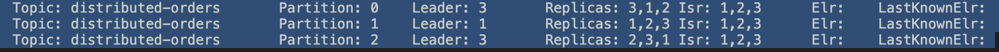 

## Exercise 4. Consumer group

1. Create a new topic with 5 partitions and 3 replicas 
```bash
docker exec -it kafka-4-1 \
  /opt/kafka/bin/kafka-topics.sh \
  --create \
  --topic consumer-lab \
  --partitions 5 \
  --replication-factor 3 \
  --bootstrap-server kafka-1:29092
```
2. Create a producer with a message key. 
```bash
docker exec -it kafka-4-1 \
  /opt/kafka/bin/kafka-console-producer.sh \
  --topic consumer-lab \
  --bootstrap-server kafka-1:29092 \
  --reader-property parse.key=true \
  --reader-property key.separator=:
``` 
- Then put these messages 
```plain text
a:1
b:2
c:3
e:3
r:2
a:3
b:8
h:10
r:11
h:6
z:3
```
4. Create a consumer with a group called "order-workers"
```bash 
docker exec -it kafka-4-1 \
  /opt/kafka/bin/kafka-console-consumer.sh \
  --topic consumer-lab \
  --group order-workers \
  --bootstrap-server kafka-1:29092 \
  --formatter-property print.key=true \
  --formatter-property print.partition=true \
  --formatter-property print.offset=true \
  --formatter-property print.value=true
```

5. Create one more consumer in the group 
```bash
docker exec -it kafka-4-2 \
  /opt/kafka/bin/kafka-console-consumer.sh \
  --topic consumer-lab \
  --group order-workers \
  --bootstrap-server kafka-2:29092 \
  --formatter-property print.key=true \
  --formatter-property print.partition=true \
  --formatter-property print.offset=true \
  --formatter-property print.value=true
```

6. Check 
```bash 
docker exec -it kafka-4-1 \
  /opt/kafka/bin/kafka-consumer-groups.sh \
  --bootstrap-server kafka-1:29092 \
  --describe \
  --group order-workers \
  --members \
  --verbose
```


## Exercise 4.2. Rebalance.

- Check for rebalancing
1. Check the partitions for each consumer
```bash
docker exec -it kafka-4-1 \
  /opt/kafka/bin/kafka-consumer-groups.sh \
  --bootstrap-server kafka-1:29092 \
  --describe \
  --group order-workers \
  --members \
  --verbose
```
2. Kill consumer B (it can be A too) with "Control + C"
3. Check again 
```bash
docker exec -it kafka-4-1 \
  /opt/kafka/bin/kafka-consumer-groups.sh \
  --bootstrap-server kafka-1:29092 \
  --describe \
  --group order-workers \
  --members \
  --verbose
```


## Exercise 4.2. Consumer Group Offset.
Continue 

1. Check current offset. 
```bash
docker exec -it kafka-4-1 \
  /opt/kafka/bin/kafka-consumer-groups.sh \
  --bootstrap-server kafka-1:29092 \
  --describe \
  --group order-workers
```
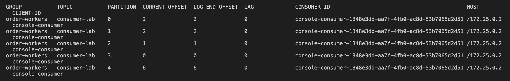
Explanation: 
- CURRENT-OFFSET is the current offset. hahaha
- LOG-END-OFFSET: Where the partition data currently ends.
- LAG  = current_offset - log-end-offset

2. Kill every consumer, with "Control + C" 
3. Produce a message with the producer. 

4. Check current offset again
```bash
docker exec -it kafka-4-1 \
  /opt/kafka/bin/kafka-consumer-groups.sh \
  --bootstrap-server kafka-1:29092 \
  --describe \
  --group order-workers
```
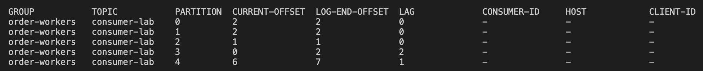
There is lag in partition-3 and partition-4.
## Exercise 5. Delivery Semantics / Offset Commit

1. Create a topic called delivery-lab 
```bash
docker exec -it kafka-5-1 \
  /opt/kafka/bin/kafka-topics.sh \
  --create \
  --topic delivery-lab \
  --partitions 3 \
  --replication-factor 3 \
  --bootstrap-server kafka-1:29092
```
2. You may check 
```bash
docker exec -it kafka-5-1 \
  /opt/kafka/bin/kafka-topics.sh \
  --describe \
  --topic delivery-lab \
  --bootstrap-server kafka-1:29092
```

3. Create a producer with a key
```bash
docker exec -it kafka-5-1 \
  /opt/kafka/bin/kafka-console-producer.sh \
  --topic delivery-lab \
  --bootstrap-server kafka-1:29092 \
  --reader-property parse.key=true \
  --reader-property key.separator=:
```

4. Create new consumer group called "delivery-workers"
```bash 
docker exec -it kafka-5-1 \
  /opt/kafka/bin/kafka-console-consumer.sh \
  --topic delivery-lab \
  --group delivery-workers \
  --from-beginning \
  --bootstrap-server kafka-1:29092 \
  --formatter-property print.partition=true \
  --formatter-property print.offset=true \
  --formatter-property print.key=true \
  --formatter-property print.value=true
```

5. Check the committed status 
```bash
docker exec -it kafka-5-1 \
  /opt/kafka/bin/kafka-consumer-groups.sh \
  --bootstrap-server kafka-1:29092 \
  --describe \
  --group delivery-workers
```
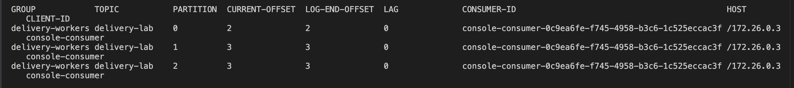
6. Stop consumer group with "control + C"
7. Offset reset (Preview)
```bash
docker exec -it kafka-5-1 \
  /opt/kafka/bin/kafka-consumer-groups.sh \
  --bootstrap-server kafka-1:29092 \
  --group delivery-workers \
  --topic delivery-lab \
  --reset-offsets \
  --shift-by -1 \
  --dry-run
```
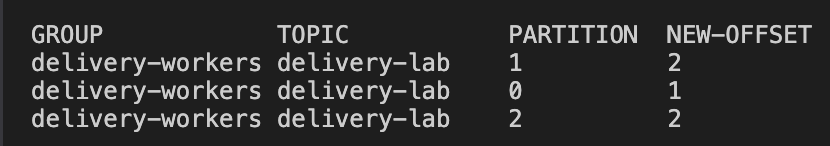
 
8. Offset reset (Execute)
```bash
docker exec -it kafka-5-1 \
  /opt/kafka/bin/kafka-consumer-groups.sh \
  --bootstrap-server kafka-1:29092 \
  --group delivery-workers-v2 \
  --topic delivery-lab \
  --reset-offsets \
  --shift-by -1 \
  --execute
```

9. Check
```bash
docker exec -it kafka-5-1 \
  /opt/kafka/bin/kafka-console-consumer.sh \
  --topic delivery-lab \
  --group delivery-workers \
  --bootstrap-server kafka-1:29092 \
  --formatter-property print.partition=true \
  --formatter-property print.offset=true \
  --formatter-property print.key=true \
  --formatter-property print.value=true
```

## Exercise 6.1. At-least-once
1. Create a topic. This time, only one partition is created. 
```bash
docker exec -it kafka-6-1 \
  /opt/kafka/bin/kafka-topics.sh \
  --create \
  --topic atleast-once-lab \
  --partitions 1 \
  --replication-factor 3 \
  --bootstrap-server kafka-1:29092
```
2. Create producer 
```bash
docker exec -it kafka-6-1 \
  /opt/kafka/bin/kafka-console-producer.sh \
  --topic atleast-once-lab \
  --bootstrap-server kafka-1:29092
```
Then send messages:
    payment-001
    payment-002
    payment-003
Then control + C
3. Create a consumer with auto commit, but the commit will occur only after 60 seconds.
```bash
docker exec -it kafka-6-1 \
  /opt/kafka/bin/kafka-console-consumer.sh \
  --topic atleast-once-lab \
  --group atleast-workers \
  --from-beginning \
  --bootstrap-server kafka-1:29092 \
  --command-property enable.auto.commit=false \
  --formatter-property print.offset=true \
  --formatter-property print.value=true
```
After 3 messages are shown, kill that consumer. Nothing has been committed yet. 
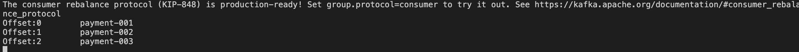
4. Look at the committed offset. 
```bash
docker exec -it kafka-6-1 \
  /opt/kafka/bin/kafka-consumer-groups.sh \
  --bootstrap-server kafka-1:29092 \
  --describe \
  --group atleast-workers
```
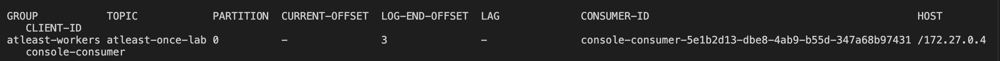
5. Then kill the consumer and create a new one 
```bash
docker exec -it kafka-6-1 \
  /opt/kafka/bin/kafka-console-consumer.sh \
  --topic atleast-once-lab \
  --group atleast-workers \
  --from-beginning \
  --bootstrap-server kafka-1:29092 \
  --command-property enable.auto.commit=false \
  --formatter-property print.offset=true \
  --formatter-property print.value=true
```
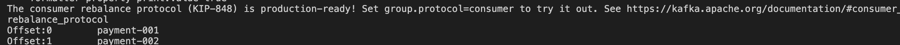

## Exercise 6.2. At-most-once 
1. Create new topic 
```bash
docker exec -it kafka-6-1 \
  /opt/kafka/bin/kafka-topics.sh \
  --create \
  --topic atmost-once-lab \
  --partitions 1 \
  --replication-factor 3 \
  --bootstrap-server kafka-1:29092
```
2. Create a producer
```bash
docker exec -it kafka-6-1 \
  /opt/kafka/bin/kafka-console-producer.sh \
  --topic atmost-once-lab \
  --bootstrap-server kafka-1:29092
```
Then send 3 messages. 
3. Simulate with this script
```bash
docker exec -it kafka-6-1 \
  /opt/kafka/bin/kafka-console-consumer.sh \
  --topic atmost-once-lab \
  --group atmost-workers \
  --from-beginning \
  --bootstrap-server kafka-1:29092 \
  --max-messages 1
```
This will let the consumer read 1 message, then exit. So 2 messages have not been read yet.
4. Then check with this script 
```bash
docker exec -it kafka-5-1 \
  /opt/kafka/bin/kafka-consumer-groups.sh \
  --bootstrap-server kafka-1:29092 \
  --describe \
  --group atmost-workers
```
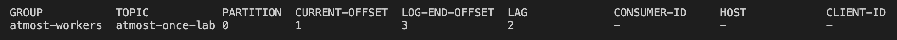
5. Kill that consumer. 
6. Create a consumer that will shift the offset by one. 
```bash
docker exec -it kafka-6-1 \
  /opt/kafka/bin/kafka-consumer-groups.sh \
  --bootstrap-server kafka-1:29092 \
  --group atmost-workers \
  --topic atmost-once-lab \
  --reset-offsets \
  --shift-by 1 \
  --execute
```
This would mean that message 2 is now committed but hasn't been processed yet. 
7. Describe that consumer group 
```bash
docker exec -it kafka-6-1 \
  /opt/kafka/bin/kafka-consumer-groups.sh \
  --bootstrap-server kafka-1:29092 \
  --describe \
  --group atmost-workers
```

## Exercise 6.3. Idempotent Consumer
1. Create topic 
```bash
docker exec -it kafka-6-1 \
  /opt/kafka/bin/kafka-topics.sh \
  --create \
  --topic idempotent-lab \
  --partitions 1 \
  --replication-factor 3 \
  --bootstrap-server kafka-1:29092
```
2. Create a producer. 
```bash
docker exec -it kafka-6-1 \
  /opt/kafka/bin/kafka-console-producer.sh \
  --topic idempotent-lab \
  --bootstrap-server kafka-1:29092
```
3. Install confluent_kafka
```bash
pip install confluent-kafka
```
4. Run consumer.py
```bash
python consumer.py
```
**Make sure you're in exercise-6.** 
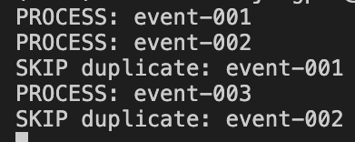

5. Note
This is just a simulation of the idempotent consumer concept. Data is stored in RAM, so it'll be deleted after the process restarts. 

## Exercise 6.4. Exactly Once 
1. Create 2 topics, input and output. 
- Input
```bash
docker exec -it kafka-6-1 \
  /opt/kafka/bin/kafka-topics.sh \
  --create \
  --topic eos-input \
  --partitions 1 \
  --replication-factor 3 \
  --bootstrap-server kafka-1:29092
```
- Output
```bash
docker exec -it kafka-6-1 \
  /opt/kafka/bin/kafka-topics.sh \
  --create \
  --topic eos-output \
  --partitions 1 \
  --replication-factor 3 \
  --bootstrap-server kafka-1:29092
```
2. Create a producer
```bash
docker exec -it kafka-6-1 \
  /opt/kafka/bin/kafka-console-producer.sh \
  --topic eos-input \
  --bootstrap-server kafka-1:29092
```
Then send just one message: 
  order-001
3. Create a Python file. 
- Install the library. 
```bash
pip install confluent-kafka
```
- Create a file called "exactly_once.py"
- Run 
```bash 
python exactly_once.py
```
4. Check the output 
```bash
docker exec -it kafka-6-1 \
  /opt/kafka/bin/kafka-console-consumer.sh \
  --topic eos-output \
  --from-beginning \
  --bootstrap-server kafka-1:29092 \
  --isolation-level read_committed
```
5. Check the committed input offset
```bash
docker exec -it kafka-6-1 \
  /opt/kafka/bin/kafka-consumer-groups.sh \
  --bootstrap-server kafka-1:29092 \
  --describe \
  --group eos-workers
```

## Exercise 7. Producer reliability under failure. 
1. Create Topic
```bash
docker exec -it kafka-7-1 \
  /opt/kafka/bin/kafka-topics.sh \
  --create \
  --topic producer-reliability-lab \
  --partitions 1 \
  --replication-factor 3 \
  --bootstrap-server kafka-1:29092
```
2. Check 
```bash
docker exec -it kafka-7-1 \
  /opt/kafka/bin/kafka-topics.sh \
  --describe \
  --topic producer-reliability-lab \
  --bootstrap-server kafka-1:29092
```
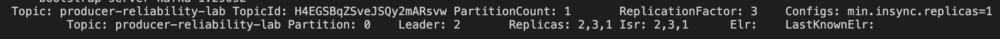
My leader is broker 2. 

3. Stop a follower broker. Broker 3 will be stopped. 
```bash
docker stop kafka-7-3
```
4. Describe topic again. 
```bash
docker exec -it kafka-7-1 \
  /opt/kafka/bin/kafka-topics.sh \
  --describe \
  --topic producer-reliability-lab \
  --bootstrap-server kafka-1:29092
```
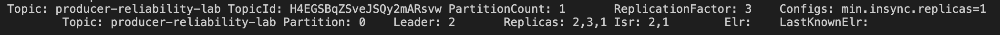

5. 
```bash
docker exec -it kafka-7-1 \
  /opt/kafka/bin/kafka-console-producer.sh \
  --topic producer-reliability-lab \
  --bootstrap-server kafka-1:29092 \
  --producer-property acks=1
```

